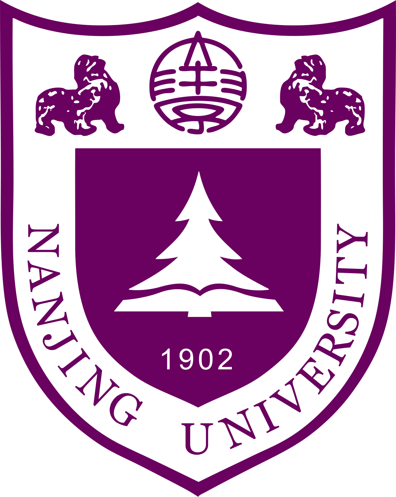
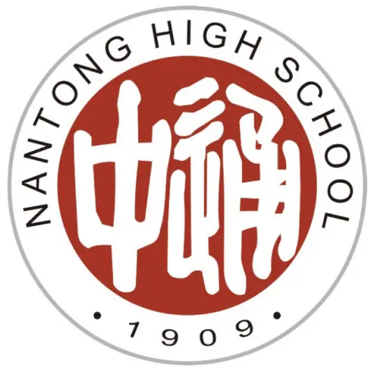
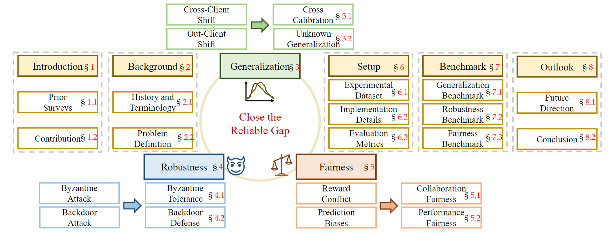








# 🤵🏻 About Me

My name is Rui Zhu (Ray, 朱睿), an 3rd-year undergraduate student at School of Intelligence Science and Technology in Nanjing University, where I am very fortunate to be advised by [Prof. Lan-Zhe Guo](https://www.lamda.nju.edu.cn/guolz/).

<!-- ►How to pronounce?
My name is pronounced as "Gwan-chung Wan". The "Gwan" rhymes with "man", and "chung" sounds like "chung" in "chunk". -->

Also, I am a member of D3 Lab at College of William and Mary, working closely with [Yang Li](https://littlestone111.github.io/) and [Prof. Hai-Peng Chen](https://haipeng-chen.github.io/).

  

# 🎓 Research 
<!-- "All things are interconnected, this is the essence of nature."  -->

<!-- <dt style="text-align: center; margin: 0; padding: 0;">
  
</dt> -->

My long-term goal is to build a safe, reliable, and efficient AI system, achieving artificial general intelligence (AGI). Most recently, my research mainly focuses on (Multimodal) Large Language Models (LLMs) and their applications:

a) How to design advanced algorithms for improve the reasoning abilities in LLMs? 
- *e.g.*, Supervised Fine-Tuning, Reinforcement Learning, Test-Time Scaling

b) How to improve the efficiency of reasoning? 
- *e.g.*, Fast/Slow Thinking, Over-Thinking, Long CoT Compression

c) How to apply LLMs in more real-world tasks? 
- *e.g.*, Math Reasoning, Legal Reasoning, Visual Reasoning

 

# 📖 Education

  

    <strong>2022.09 - 2026.06</strong> 
    Undergraduate, School of Intelligence Science and Technology, Nanjing University
  

  

    
  

  

    <strong>2019.09 - 2022.06</strong> 
    High School, Nantong High School (江苏省南通中学)
  

  

    
  

# 🔥 News

<ul>
  <!-- <li><em>2025.05:</em> 🎉 Some papers were accepted by <strong>ICML 2025</strong> with <strong class="co-first"> Two Spotlights (Top 2.6%)</strong>. See you in Vancouver!</li>
  <li><em>2024.11:</em> 🎈I was honored with <strong>Lei Jun Excellence Scholarship</strong> ~ <strong>100k</strong> (The <strong><u>Highest</u></strong> Scholarship at Wuhan University, <strong><u>Top-4</u></strong> among All Undergraduates, Award Rate ~ <strong>0.01%</strong>)</li>
  <li><em>2024.04:</em> 🚀 Explore our pre-print: a deep look at using Graph Neural Networks in Epidemic Modeling. Check our collected <a href="https://github.com/Emory-Melody/awesome-epidemic-modeling-papers">paper list</a>.</li> -->
  <li><em>2025.05:</em> 🚀 I built this personal website! Hope you like it.</li>
</ul>

 

# 📃 Publications

**&dagger; Equal Contribution**   

<!-- 

2025 

<dl>
  <dt>
  TPAMI 2024
  </dt>
  <dd><a href="https://arxiv.org/abs/2311.06750"><strong>Federated Learning for Generalization, Robustness, Fairness: A Survey and Benchmark</strong></a></dd>
  <dd>Wenke Huang, Mang Ye, Zekun Shi, <strong>Guancheng Wan</strong>, He Li, Bo Du,  Qiang Yang
  </dd>
    <dd>IEEE Transactions on Pattern Analysis and Machine Intelligence (<strong>TPAMI</strong>), 2024</dd>
    <dd><a href="https://github.com/WenkeHuang/MarsFL">Project Page</a></dd>
</dl> -->
Wait to be updated...

 

# 🎡 Service

## Conference Committee Member
<!-- - Reviewer for ICML'2025, ICLR'2025, NeurIPS'2024/2025, AISTATS'2025
- Reviewer for CVPR'2024/2025, ICCV'2025, ECCV'2024 -->
- Reviewer for IJCAI'2025, ECAI'2025

<!-- ##  Journal Reviewer
- IEEE TIFS, TIP, TKDE, TNNLS
- ACM TKDD
- Pattern Recognition (PR)
- Data-centric Machine Learning Research (DMLR) -->

 

# 🎖 Honors

Wait to be updated...

<!-- - *2024.11* **Lei Jun Excellence Scholarship** (**<u>雷军卓越奖学金</u>**) **~100k** (The **<u>Highest</u>** Scholarship at Wuhan University, **<u>Top-4</u>** among All Undergraduates, Award Rate: 10/65000+ ~ **0.01%**)  *Wuhan University*

- *2023.09* **National Scholarship** **(<u>Twice</u>)** (**<u>国家奖学金</u>**) (Award Rate: <strong>0.2% nation-wide</strong>) *Ministry of Education, China* 

- *2022.09* **National Scholarship** (**<u>国家奖学金</u>**) (Award Rate: <strong>0.2% nation-wide</strong>) *Ministry of Education, China* 

- *2024.10* **Luojia Undergraduate Innovation Research Fund** (首批珞珈本科生研究基金) ~50k (4 Students department-wide)  *Wuhan University*

- *2024.06* **Lei Jun Computer Innovation and Development Fund** and  **Research Fund** (雷军创新发展基金、雷军研究基金) (3 Students department-wide)  *Wuhan University*

- *2024.06* <a href="https://scholarship2024.sensetime.com/cn/">**SenseTime Scholarship**</a> (商汤奖学金) ~20k (**25 Students nation-wide**) *SenseTime*

- *2024.04* <a href="https://mp.weixin.qq.com/s/zdx8hH8-g0FScgZvkYQRnw">**CS Pioneer**</a> (计科先锋年度人物) (10 Students department-wide)  *Wuhan University*

- *2023.10* **CCF (China Computer Federation) Elite Collegiate Award** (CCF优秀大学生) (102 Students nation-wide) *China Computer Federation*

- *2023.10* **Pacemaker to Merit Student** (三好学生标兵) (Award Rate: 60/65000+ ~ <strong>0.1%</strong>) *Wuhan University* -->

 

<dl>

</dl>

<!-- # Miscellaneous

  
<strong>Talks and Shares</strong>

<dd><a href="https://www.bilibili.com/video/BV1gZ42177VL/?spm_id_from=333.337.search-card.all.click&vd_source=0b7a3cc3d3ec288abaca83b9a7e036af"><strong>泛化图学习与本科生科研经历分享</strong></a></dd>

  
<strong>Undergraduate research resource and enrollment process</strong>

<dd><a href="https://zxeupbuzh9y.feishu.cn/docx/ZDEsdpZtPosRWOxcBnkcF8Hknkd"><strong>Link</strong></a></dd>

  
<strong>Poems that inspire me</strong>

  <dd><strong>白鹭立雪，愚者看鹭，聪者观雪，智者见白</strong> —— A white egret stands in the snow. The foolish see only the egret, the wise observe the snow, and the enlightened perceive the whiteness.</dd>
  <dd><strong>世界不黑也不白, 而是一道精致的灰</strong> —— The world is neither black nor white, but a delicate shade of gray. </dd>
    <dd><strong>风吹到哪页读哪页</strong> —— The wind blows to which page, read which page.. </dd>

 -->

